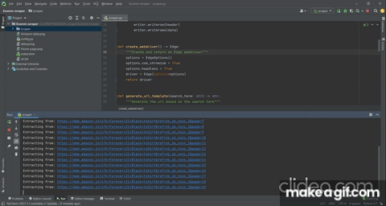

# Ecomm-scraper
--------------------------------------------------------------------

# Aim

- Crawls to Amazon website using selenium webdriver
- Searches specific product based on keyword entered by user
- Scrapes data from pages of search results
- Stores data in the form of a .csv file 

# Language
- Python

# Modules used
- BeautifulSoup
- requests
- selenium 
--------------------------------------------------------------------
# Note 

This project was a part of academic curriculum. 
Build purely for educational purpose.
